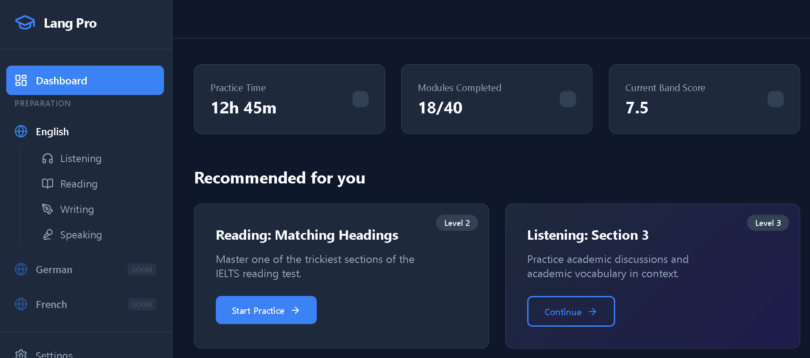

# LanguageUnlearn - IELTS Learning App

LanguageUnlearn is a comprehensive language learning platform (IELTS, German, French, Spanish) built with React, TypeScript, and Vite. It provides practice exercises and study materials for Listening, Reading, Writing, and Speaking (LRWS).

## Screenshots


*App interface showing the dashboard and learning sections.*

## Features

- **LRWS Modules**: Dedicated sections for Listening, Reading, Writing, and Speaking.
- **Practice Quizzes**: Interactive exercises to test your skills.
- **Progress Tracking**: (Add details if available)
- **Modern UI**: Clean and intuitive design for focused learning.

## Installation

Follow these steps to set up the project locally:

1. **Clone the repository**:
   ```bash
   git clone <repository-url>
   cd LanguageUnlearn
   ```

2. **Install dependencies**:
   Make sure you have [Node.js](https://nodejs.org/) installed. Then run:
   ```bash
   npm install
   ```

3. **Run the development server**:
   ```bash
   npm run dev
   ```
   The application will be available at `http://localhost:5173/` (or the port shown in your terminal).

4. **Build for production**:
   ```bash
   npm run build
   ```

## Technologies Used

- React 19
- TypeScript
- Vite
- Framer Motion (for animations)
- Lucide React (for icons)
- React Router DOM (for navigation)

